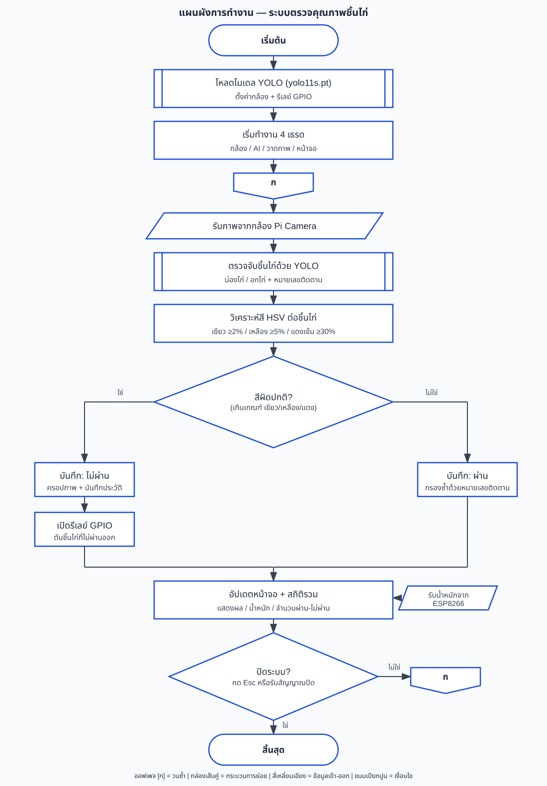

<div align="center">

# 🐔 Chicken Quality Control System

**Real-time poultry defect inspection on the edge — YOLO11 vision + HSV color analysis + pneumatic reject, running on a single Raspberry Pi 5.**


</div>

---

A production-line vision system that watches chicken pieces travel down a conveyor, decides **pass / reject** in real time, and physically kicks the bad ones off the belt — while a wireless load cell tallies the weight of everything that passes.

## How it works

A Pi Camera feeds four cooperating threads. YOLO11 locates and tracks each piece; an HSV color gate inspects the center of every detection for spoilage and foreign matter; verdicts drive a GPIO relay that fires a pneumatic pusher after the belt-delay. Nothing blocks the display.

```
Camera ─▶ AI ─┬─▶ Render ─▶ Display
              ├─▶ GPIO relay ─▶ pneumatic reject
              └─▶ reject crops · CSV/TXT logs · snapshots

ESP8266 load cell ─(UDP / serial, 10 Hz)─▶ weight peak-hold ─▶ Display
```

<div align="center">

</div>

## Features

- [x] **Real-time detection** — YOLO11 ONNX tracking, 3 classes (`drumstick`, `breast`, `foreign`)
- [x] **Color-based QC** — per-piece HSV gate with adaptive white balance from the belt background
- [x] **Center-crop analysis** — inspects the middle of each box, ignoring background bleed at the edges
- [x] **Pneumatic reject** — GPIO24 → relay → 24 V solenoid, timed to the belt travel delay
- [x] **Wireless weighing** — ESP8266 load cell streams grams over Wi-Fi (UDP) or USB; Pi does peak-hold detection as each piece crosses the scale
- [x] **Deduplication** — track IDs + cooldown stop the same piece being counted twice
- [x] **Full audit trail** — reject crops, per-piece TXT/CSV logs, and thumbnail snapshots, all foldered by day
- [x] **Thai touchscreen UI** — full-screen CustomTkinter dashboard with live counts and color bars

## Rejection criteria

Evaluated on the center crop, in order — first hit wins:

| Verdict | Trigger | |
|---|---|---|
| 🟣 `REJECT-FOREIGN` | blue/purple pixels ≥ 15% | non-chicken object |
| 🟢 `REJECT-GREEN` | green pixels ≥ 2% | spoilage |
| 🟡 `REJECT-YELLOW` | yellow pixels ≥ 25% | discoloration |
| 🔴 `REJECT-RED` | deep-red pixels ≥ 5% | bruising / blood |
| ✅ `PASS` | none of the above | ships + weighed |

## Hardware

| Part | Role |
|---|---|
| Raspberry Pi 5 | vision, inference, UI, control |
| Pi Camera Module | overhead belt view |
| ESP8266 + load cell | wireless scale (`esp8266_scale/esp8266_scale.ino`) |
| Relay + 24 V solenoid valve | pneumatic reject gate on GPIO24 |

## Quick start

```bash
pip install ultralytics opencv-python pillow customtkinter picamera2 pyserial RPi.GPIO
python main.py          # Esc to exit full-screen
```

Install a Thai font (Noto Sans Thai / Loma / Sawasdee / TH Sarabun New) for on-frame text. The ESP8266 broadcasts plain-text grams to UDP `:5005` on the same Wi-Fi — set `MODE = "serial"` in `weight.py` to use USB instead.

## Project layout

```
chicken/
├── main.py                 # camera · AI · render · display pipeline + GPIO reject
├── GUI.py                  # CustomTkinter dashboard (layout only)
├── weight.py               # ESP8266 peak-hold weight receiver (UDP / serial)
├── esp8266_scale/          # load-cell firmware (Arduino)
├── merge_datasets.py       # dataset prep
├── train_v5.py             # training entry
├── data.yaml               # YOLO dataset config (3 classes)
├── test_weight.py          # weight peak-hold self-check
└── runs/chicken_v3.onnx    # deployed model (weights git-ignored)
```

## Training

```bash
yolo detect train model=yolo11s.pt data=data.yaml epochs=100 imgsz=640
```

Export the trained run to ONNX and point `WEIGHTS` in `main.py` at it.

## Tuning knobs

Real belts and real load cells drift — the constants at the top of each module are meant to be adjusted on-site:

| Where | Knob | Meaning |
|---|---|---|
| `main.py` | `BELT_DELAY_SEC`, `PUSH_DURATION` | camera→pusher travel time, cylinder hold |
| `main.py` | `CONF_THRESHOLD`, `COUNT_COOLDOWN` | detection confidence, anti-double-count gap |
| `weight.py` | `IDLE_THRESHOLD`, `MIN_WEIGHT_G`, `MIN_DWELL_SEC` | scale baseline and peak-hold gating |
